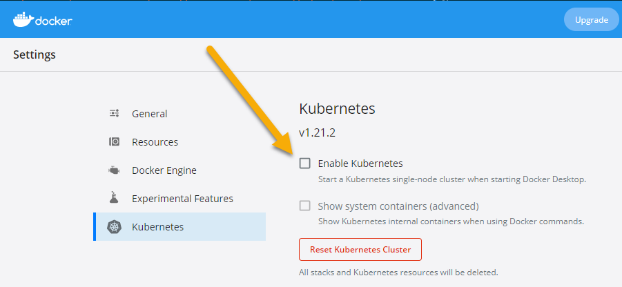

# Kubernetes

[Kubernetes](https://kubernetes.io) is the most popular container platform, largely because it's supported by all the clouds and many on-prem vendors. You can run Kubernetes in a managed service, or in the datacenter, or on your laptop and it works in the same way.

You need to invest time to learn Kubernetes - the [Kubernetes Course Labs](https://kubernetes.labs.co) course is a four day class of its own. Ultimately Kubernetes runs your apps in containers using the same images you use with the Docker CLI or with Compose or swarm, but the model is very different.

# Reference

- [How much Kubernetes do I need to learn?](https://docker.events.cube365.net/dockercon-live/2021/content/Videos/zo9AAafDLCPRv2rom) - the Number 1 session from DockerCon 2021

# Set up Kubernetes

You can run Kubernetes with Docker Desktop - open the settings window, click _Kubernetes_, tick the _Enable Kubernetes_ button and hit _Apply & Restart_:



If you're not using Docker Desktop, the best option is to use [k3d](https://k3d.io/#installation), which is a lightweight Kubernetes distribution.

Install the k3d command line **if you're not using Kubernetes on Docker Desktop**:

```
# Mac
brew install k3d

# Windows
choco install k3d

# Linux
curl -s https://raw.githubusercontent.com/rancher/k3d/main/install.sh | bash
```

Create a cluster:

```
k3d cluster create labs -p "30000:30000@server[0]"
```

[Kubectl](https://kubernetes.io/docs/reference/generated/kubectl/kubectl-commands) (pronounced "kube-cuttle" although not everyone agrees...) is the CLI for working with Kubernetes. 

**Whichever type of cluster you're using**, run this to list the nodes:

```
kubectl get nodes
```

# Simple Pod

Kubernetes models applications with lots of abstractions. [Pods](https://kubernetes.io/docs/concepts/workloads/pods/) run containers:

- [pods/sleep.yaml](./pods/sleep.yaml) - defines a Pod which runs a container from an image on Docker Hub. This container doesn't do anything :)

Deploy the application with Kubectl:

``` 
kubectl apply -f labs/kubernetes/pods/sleep.yaml
```

> Kubernetes uses a desired-state approach, you'll see the pod gets created. Repeat the command and you'll get an `unchanged` message.

📋 List all the Pods to check the status.

<details>
  <summary>Not sure how?</summary>

```
# kubectl uses a standard [verb] [object] syntax:
kubectl get pods
```

</details><br/>

> Kubernetes pulls the image from Docker Hub and starts a container in the Pod. You'll see the Pod status as either `ContainerCreating` or `Running`.

You can get extra information on Kubernetes objects with the `describe` command:

```
kubectl describe po sleep
```

> `po` is a short alias for `pods`. The output shows you all the Pod details and a list of events; you'll see the image pull and the container creation events.

Pods have the responsibility to keep their containers running. If the container process stops and the container exits, the Pod starts a replacement container.

Run a command in the sleep Pod to kill the container process:

```
kubectl exec sleep -- kill 1
```

📋 List the Pods and check the events of the sleep Pod.

<details>
  <summary>Not sure how?</summary>

```
# the Pod list shows the restart count:
kubectl get pods

# the details show the container being replaced:
kubectl describe pod sleep
```

</details><br/>

> When Pod containers exit the Pod is restarted - but that doesn't mean restarting the same container, a new container gets created.

Pods are the compute abstraction, but you can't publish ports to send traffic to Pod containers. Your application network is modelled with another abstraction - the Service.

## Services

[Services](https://kubernetes.io/docs/concepts/services-networking/service/) model the networking between Pods and from the outside world into your Pod containers. They're separate objects which receive traffic and direct it to Pods. They use [labels](https://kubernetes.io/docs/concepts/overview/working-with-objects/labels/) to identify the target Pods:

- [services/whoami-nodeport.yaml](./services/whoami-nodeport.yaml) - describes a service which listens on port 30000 on the cluster, and sends traffics to any Pods with the label `app=whoami`.

📋 Deploy the Service and print its details.

<details>
  <summary>Not sure how?</summary>

```
# apply is used for all types of object:
kubectl apply -f labs/kubernetes/services/

# list the Services:
kubectl get service

# the details show Service's IP address and ports:
kubectl describe service whoami-np
```

</details><br/>

> Target Pods for a Service are called endpoints - there are none for this Service because there are no Pods with the matching label.

You can browse to the Service on the external port, but you'll get an empty response:

```
curl http://localhost:30000
```

## Services over Pods

This spec will create a Pod with the `app=whoami` label:

- [pods/whoami.yaml](./pods/whoami.yaml) - uses the whoami image on Docker Hub which we've run for other labs

As soon as you deploy the Pod, the Service will see there's now a match for the label and it will enlist the Pod's IP address into its endpoints.

📋 Deploy the whoami Pod and confirm it gets added to the Service endpoints.

<details>
  <summary>Not sure how?</summary>

```
# you can apply all the YAML files:
kubectl apply -f labs/kubernetes/pods/

# list Pods with a label selector, showing additional output:
kubectl get pods -l app=whoami -o wide

# the Pod IP will be in the Service endpoints:
kubectl describe service whoami-np
```

</details><br/>


> Now the Service has a target Pod; it will send incoming traffic on port 30000 to the whoami Pod on port 80

The app works now:

```
curl http://localhost:30000
```

> The IP address and hostname of the Pod are part of the container environment. This time it's Kubernetes setting that up, and passing the configuration it wants to Docker to run the container.

You are now a Kubernetes expert 😀 

Well, not quite - there are a lot more abstractions in the Kubernetes model. It's complex to learn because it's so powerful, but you can run any type of application in Kubernetes and it's becoming the industry standard for containerized apps.

## Cleanup

You can delete all the objects and leave your Kubernetes cluster running:

```
kubectl delete -f ./labs/kubernetes/services/ -f ./labs/kubernetes/pods/
```

And if you're using k3d you can remove the cluster completely:

```
k3d cluster delete labs
```

Or with Docker Desktop, go back into settings and untick the _Enable Kubernetes_ option.